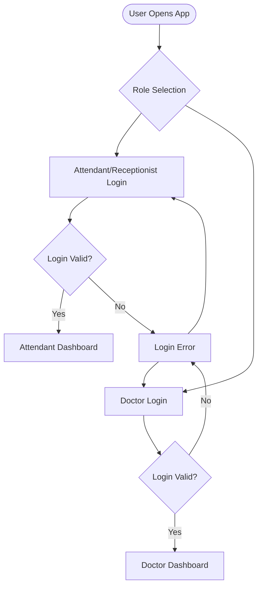
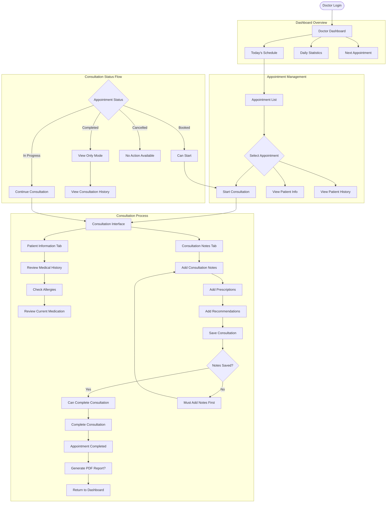
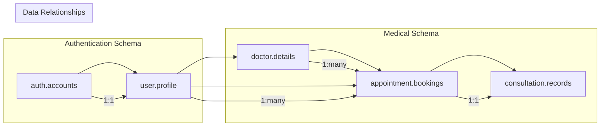
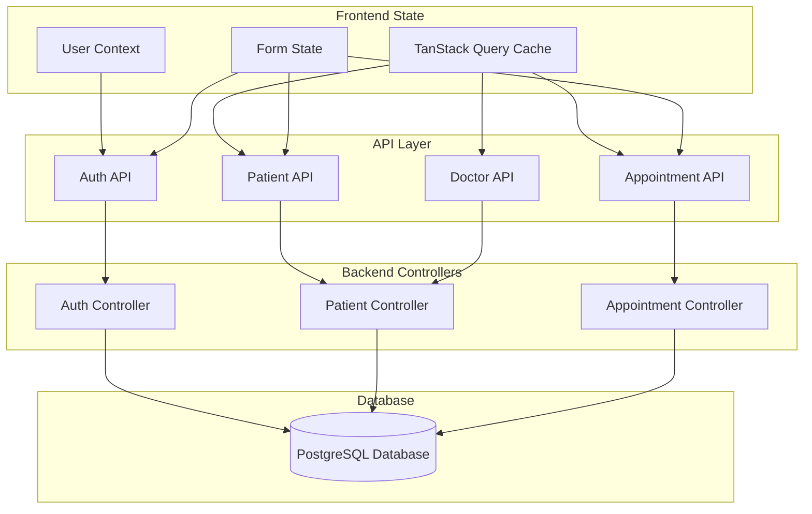
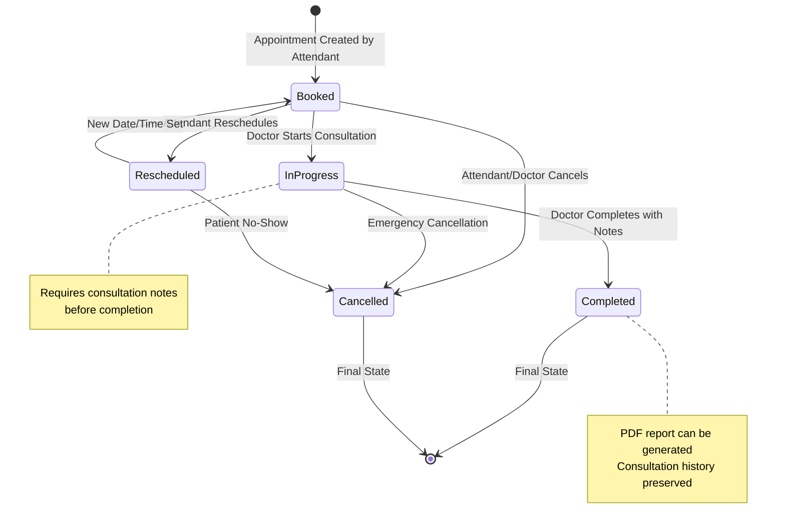
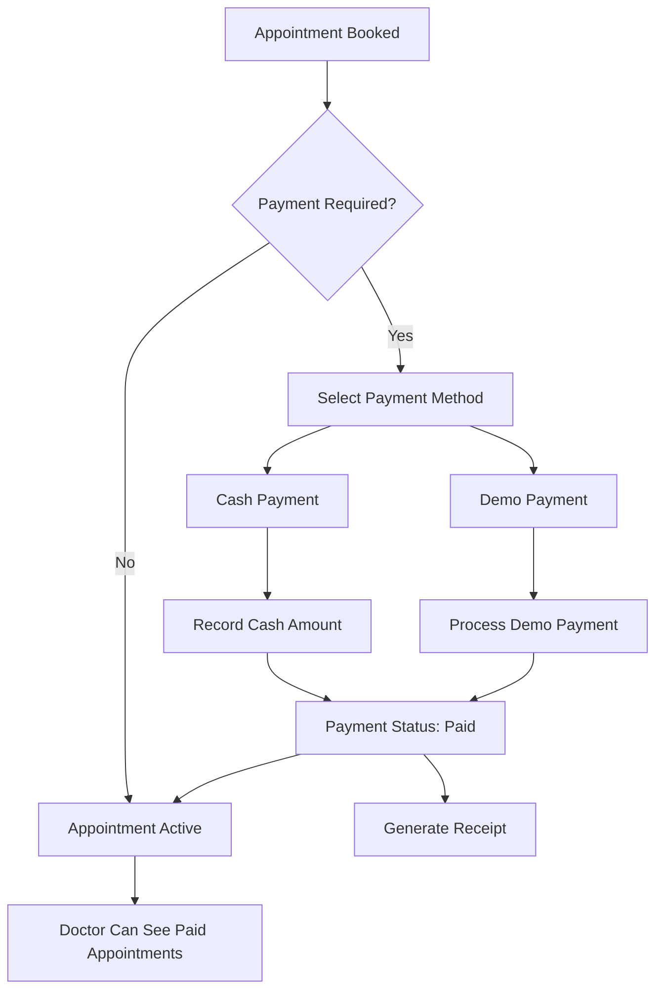
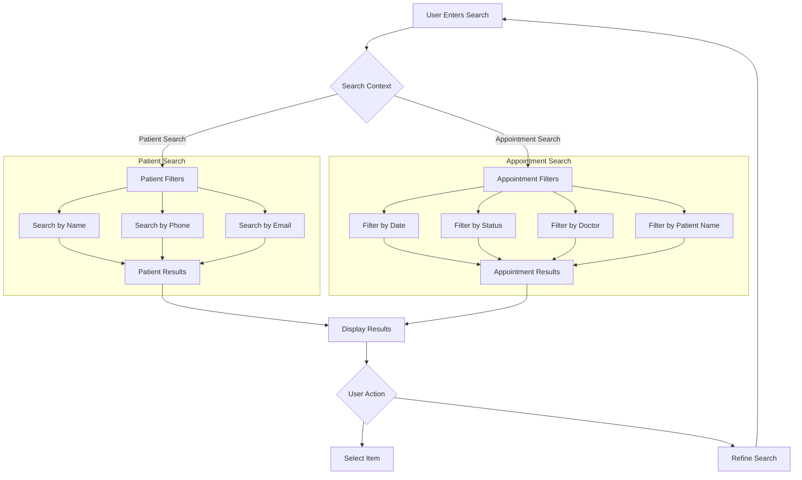
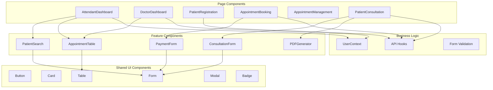
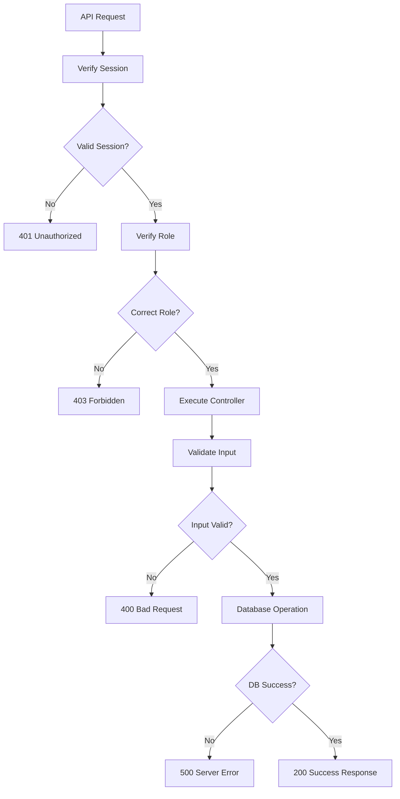
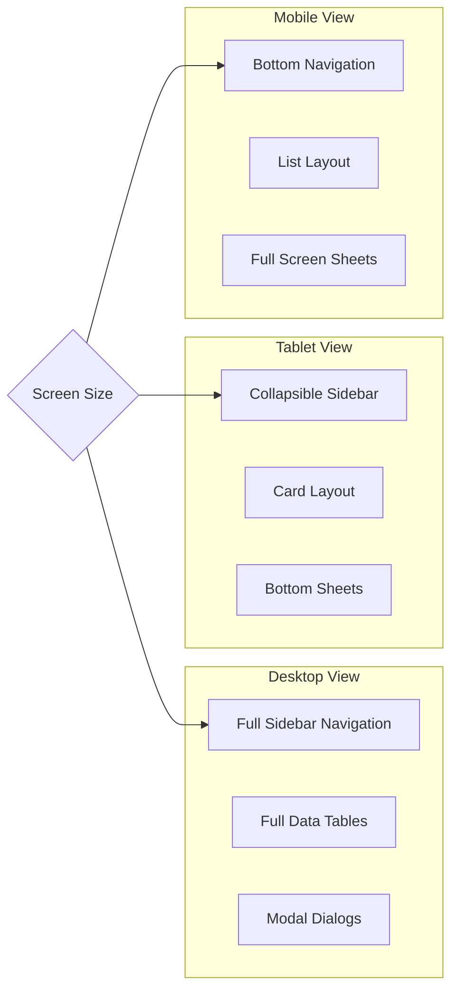

# 🏥 Clinic Management System - Complete Application Flow

## 🚀 **System Overview**

This flowchart shows the complete flow of the Clinic Management System, including all routes, features, user interactions, and data flow between frontend and backend.

---

## 🔐 **Authentication & Role Flow**



---

## 👥 **User Roles & Permissions**

### **Attendant/Receptionist Role:**
- ✅ Patient registration & search
- ✅ Appointment booking & management
- ✅ Payment processing (demo)
- ✅ View all appointments
- ❌ Cannot conduct consultations

### **Doctor Role:**
- ✅ View assigned appointments only  
- ✅ Start/complete consultations
- ✅ Add consultation notes & prescriptions
- ✅ View patient medical history
- ❌ Cannot register patients or book appointments

---

## 🏥 **Complete Application Flow**

```mermaid
flowchart TB
    subgraph "Frontend Routes"
        A1[/auth/role-selection] 
        A2[/auth/login]
        A3[/auth/signup]
        A4[/auth/logout]
        
        B1[/ - Attendant Dashboard]
        B2[/patients - Patient List]  
        B3[/patients/register - Register Patient]
        B4[/appointments - Appointment Management]
        B5[/appointments/book - Book Appointment]
        B6[/payments/:appointmentId - Process Payment]
        
        C1[/doctor - Doctor Dashboard]
        C2[/doctor/consultation/:id - Patient Consultation]
    end
    
    subgraph "Backend API Routes"
        D1[POST /api/auth/login]
        D2[POST /api/auth/register-user] 
        D3[POST /api/auth/register-patient]
        
        E1[GET /api/patients]
        E2[GET /api/patients/search]
        E3[GET /api/doctors]
        E4[GET /api/doctors/:id]
        
        F1[POST /api/appointment/add-appointment]
        F2[GET /api/appointment/get-appointments]
        F3[GET /api/appointment/:id]
        F4[PUT /api/appointment/start/:id]
        F5[PUT /api/appointment/complete/:appointment_id]
        F6[PUT /api/appointment/cancel/:appointment_id]
        F7[PUT /api/appointment/reschedule/:appointment_id]
        F8[PUT /api/appointment/pay/:appointment_id]
        F9[POST /api/appointment/consultation]
        
        G1[GET /api/patients/consultation/:id]
    end
    
    A1 --> A2
    A2 --> D1
    D1 -->|Attendant| B1
    D1 -->|Doctor| C1
```

---

## 📋 **Attendant Workflow - Complete Feature Flow**

```mermaid
flowchart TD
    AttStart([Attendant Login]) --> AttDash[Attendant Dashboard]
    
    subgraph "Dashboard Features"
        AttDash --> SearchBox[Patient Search Box]
        AttDash --> TodayStats[Today's Statistics]
        AttDash --> QuickActions[Quick Actions]
    end
    
    subgraph "Patient Management"
        SearchBox --> PatientSearch{Search Results}
        PatientSearch -->|Found| PatientDetails[View Patient Details]
        PatientSearch -->|Not Found| RegisterNew[Register New Patient]
        
        RegisterNew --> RegForm[Registration Form]
        RegForm --> RegValidation{Form Valid?}
        RegValidation -->|Yes| PatientCreated[Patient Created]
        RegValidation -->|No| RegError[Show Validation Errors]
        RegError --> RegForm
        
        PatientCreated --> BookApt[Book Appointment?]
    end
    
    subgraph "Appointment Booking"
        QuickActions --> BookAppointment[Book New Appointment]
        BookApt --> BookAppointment
        
        BookAppointment --> SelectPatient[Select Patient]
        SelectPatient --> SelectDoctor[Select Doctor]
        SelectDoctor --> SelectDateTime[Select Date & Time]
        SelectDateTime --> AddNotes[Add Notes (Optional)]
        AddNotes --> ReviewBooking[Review Booking Details]
        
        ReviewBooking --> ProcessPayment[Process Payment]
        ProcessPayment --> PaymentMethod{Payment Method}
        PaymentMethod -->|Cash| CashPayment[Record Cash Payment]
        PaymentMethod -->|Demo| DemoPayment[Demo Payment]
        
        CashPayment --> AptCreated[Appointment Created]
        DemoPayment --> AptCreated
        AptCreated --> PrintReceipt[Print Receipt?]
    end
    
    subgraph "Appointment Management"
        QuickActions --> ViewAppointments[View All Appointments]
        ViewAppointments --> AptList[Appointment List]
        AptList --> AptActions{Select Action}
        
        AptActions --> ViewDetails[View Details]
        AptActions --> Reschedule[Reschedule]
        AptActions --> Cancel[Cancel]
        AptActions --> ViewNotes[View Consultation Notes]
        
        Reschedule --> NewDateTime[Select New Date/Time]
        NewDateTime --> AptRescheduled[Appointment Rescheduled]
        
        Cancel --> ConfirmCancel{Confirm Cancel?}
        ConfirmCancel -->|Yes| AptCancelled[Appointment Cancelled]
        ConfirmCancel -->|No| AptList
    end
```

---

## 👨‍⚕️ **Doctor Workflow - Complete Feature Flow**



---

## 🗄️ **Database Schema & Data Flow**



---

## 🔄 **API Data Flow & State Management**



---

## 📊 **Appointment Status State Machine**



---

## 💰 **Payment Processing Flow**



---

## 🔍 **Search & Filter Features**



---

## 🏗️ **Component Architecture**



---

## 🔐 **Security & Middleware Flow**



---

## 📱 **Responsive UI Flow**



---

## ✅ **Complete Feature Summary**

### **✅ Implemented Features:**

#### **Authentication & Authorization:**
- ✅ Role-based login (Attendant/Doctor)
- ✅ Session management with middleware
- ✅ Route protection by user role

#### **Patient Management:**
- ✅ Patient registration with full medical details
- ✅ Patient search by name, phone, email
- ✅ Patient profile management
- ✅ Medical history tracking

#### **Appointment System:**
- ✅ Appointment booking by attendants
- ✅ Doctor selection and time slots
- ✅ Appointment status management (booked → in_progress → completed)
- ✅ Appointment rescheduling
- ✅ Appointment cancellation
- ✅ Payment processing (demo/cash)

#### **Doctor Consultation:**
- ✅ Doctor dashboard with daily schedule
- ✅ Start/complete consultation workflow
- ✅ Consultation notes and prescriptions
- ✅ Patient medical history access
- ✅ PDF report generation

#### **User Interface:**
- ✅ Responsive design (mobile/tablet/desktop)
- ✅ Real-time data updates
- ✅ Form validation
- ✅ Error handling and user feedback
- ✅ Accessibility features

### **📊 Database Relations:**
- ✅ User accounts with profiles
- ✅ Doctor specialization details
- ✅ Appointment booking system
- ✅ Consultation records
- ✅ Payment tracking

### **🔄 API Endpoints:**
- ✅ 15+ REST API endpoints
- ✅ Input validation
- ✅ Error handling
- ✅ Role-based access control

---

## 🎯 **Key User Journeys**

### **👤 Attendant Journey:**
1. Login → Dashboard
2. Search/Register Patient  
3. Book Appointment
4. Process Payment
5. Manage Appointments

### **👨‍⚕️ Doctor Journey:**
1. Login → Dashboard
2. View Today's Schedule
3. Start Consultation
4. Add Notes & Prescriptions
5. Complete Consultation

### **🔄 Data Flow:**
1. Frontend Form → API Validation → Database
2. Real-time Updates → UI Refresh
3. PDF Generation → Download/Print

---

This comprehensive flowchart represents the complete functionality of your Clinic Management System, showing how all components work together to create a seamless healthcare management solution.
